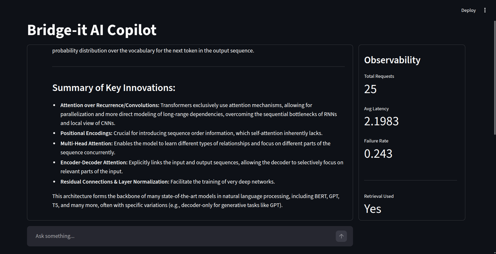
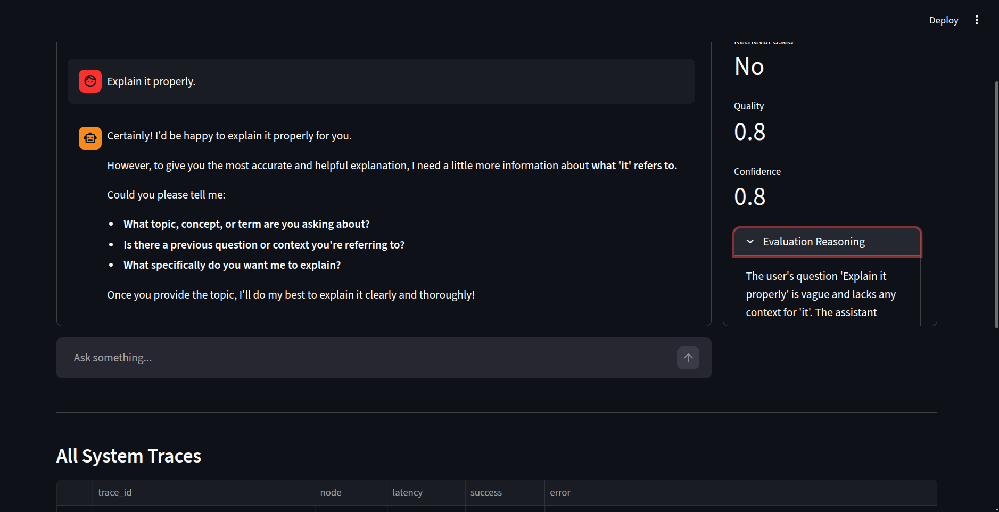
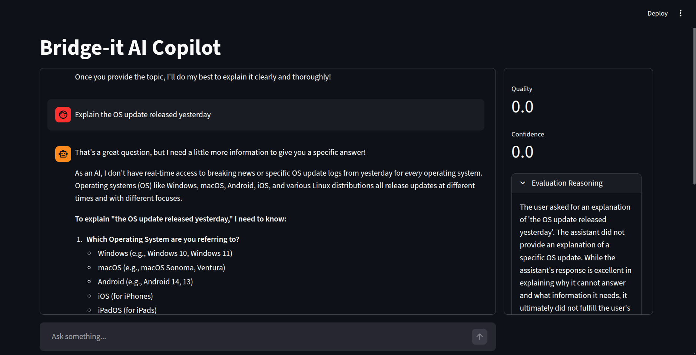

# 🚀 Bridge-it AI Copilot - Observability Framework

## 📌 Project Overview

This project implements an AI observability framework for a
domain-specific conversational assistant using **LangGraph**.

The objective is to provide **end-to-end visibility** into:

-   🖥 System health
-   🔄 Process execution flow
-   🤖 AI response quality
-   📊 Deterministic vs probabilistic behavior

The system demonstrates how developers can understand:

-   What the AI did
-   Why it did it
-   How well it performed
-   Where failures or quality issues occurred

------------------------------------------------------------------------

## 🏗 Architecture

### Core Components

-   **LangGraph** - Conversational workflow orchestration
-   **Gemini LLM** - Response generation
-   **Retrieval Layer** - Context grounding
-   **LLM Self‑Evaluation** - Quality & confidence scoring
-   **SQLite** - Persistent trace storage
-   **Streamlit** - Observability dashboard

### Workflow

Intent Detection → Conditional Routing → Retrieval → LLM Response → LLM
Evaluation

------------------------------------------------------------------------

## 🔍 Observability Design

The framework captures three layers of signals.

------------------------------------------------------------------------

### 1️⃣ System Layer (Deterministic)

-   Per-node latency
-   Success / failure status
-   Retry attempts
-   Average latency
-   Failure rate
-   Total requests

These metrics are reproducible and measurable.

------------------------------------------------------------------------

### 2️⃣ Process Flow Layer (Deterministic)

-   Node transitions
-   Conditional routing decisions
-   Retrieval usage
-   Execution trace via unique trace ID

Each conversation is assigned a trace ID stored in SQLite.

------------------------------------------------------------------------

### 3️⃣ AI Quality Layer (Probabilistic)

-   LLM-generated response
-   LLM self-evaluated quality score
-   LLM self-evaluated confidence score
-   Evaluation reasoning trace
-   Structural grounding penalties

Quality is derived from:

-   Model-based self-evaluation\
-   Deterministic penalties for lack of grounding\
-   Deterministic penalties for short responses

------------------------------------------------------------------------

## ⚖ Deterministic vs Probabilistic Signals

  Deterministic Signals   Probabilistic Signals
  ----------------------- -----------------------
  Latency                 LLM response
  Node path               Quality score
  Retrieval usage         Confidence score
  Retry attempts          Evaluation reasoning
  Failure rate            

This separation enables deep debugging of AI behavior.

------------------------------------------------------------------------

## 📸 Example Conversations

### Example 1 - Grounded High Quality

**Question:**
Explain transformer architecture.

**Expected Observations:**
- Retrieval used
- High quality score
- High confidence
- Clear evaluation reasoning



------------------------------------------------------------------------

### Example 2 --- Underspecified Query

**Question:**
Explain it properly.

**Expected Observations:**
- No retrieval used
- Lower quality score
- Lower confidence
- Grounding penalty applied



------------------------------------------------------------------------

### Example 3 --- Out-of-Domain Query

**Question:**
Explain the OS update released yesterday.

**Expected Observations:**
- No grounding context
- Reduced confidence
- Structural penalty applied



------------------------------------------------------------------------

## 🧠 How Observability Enables Debugging

This framework allows:

-   Detection of node failures
-   Identification of latency spikes
-   Retrieval malfunction detection
-   Confidence drift monitoring
-   Quality regression tracking

### Failure Scenario

If an LLM call fails:

-   Node success = 0
-   Error stored in database
-   Failure rate increases

### Quality Regression Scenario

If retrieval stops working:

-   Grounding penalty triggers
-   Quality decreases
-   Confidence decreases

------------------------------------------------------------------------

## ⚠ Limitations

1.  Self-evaluation bias - Same model generates and evaluates
    responses
2.  Simplified grounding penalties
3.  SQLite not production-scalable
4.  No token-level probability access
5.  No distributed tracing system

------------------------------------------------------------------------

## 🚀 Future Improvements

-   Separate evaluator model
-   Retrieval similarity scoring
-   Hallucination detection
-   OpenTelemetry integration
-   Prometheus / Grafana metrics
-   Distributed trace visualization

------------------------------------------------------------------------

## 🛠 Installation

``` bash
python3 -m venv venv
source venv/bin/activate
pip install -r requirements.txt
streamlit run app.py
```

------------------------------------------------------------------------

## 🎯 Assignment Requirement Checklist

✅ LangGraph-based conversational workflow\
✅ LLM interaction\
✅ Decision/routing node\
✅ Supporting retrieval component\
✅ Per-node instrumentation\
✅ System-level signals\
✅ Process flow visibility\
✅ AI quality indicators\
✅ Deterministic vs probabilistic distinction\
✅ Example conversations\
✅ Evaluation & reflection

------------------------------------------------------------------------

## 📘 Conclusion

This project demonstrates how structured observability can be applied to
AI systems by combining:

-   Deterministic system monitoring
-   Probabilistic AI behavior analysis
-   Trace-based debugging
-   Quality evaluation signals

It bridges traditional software observability with modern AI uncertainty
modeling.
